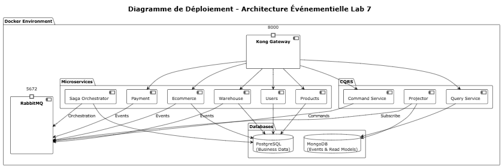

# Rapport Lab 7 - Architecture Événementielle
## LOG430 - Architecture Logicielle

## 1. Scénario Métier Retenu

### 1.1 Contexte E-commerce

Le scénario métier est une plateforme ecommerce utilisant une architecture événementielle complète. Le scénario métier central est le **processus de commande client** avec gestion des stocks, paiements et notifications.

### 1.2 Workflow Principal : Commande Client

```
Client → Panier → Commande → Validation Stock → Paiement → Expédition → Notification
```

#### Étapes Détaillées :

1. **Initiation de Commande**
   - Client finalise son panier
   - Système génère une demande de commande
   - Event `OrderInitiated` publié

2. **Validation des Stocks**
   - Service Warehouse vérifie la disponibilité
   - Réservation des articles si disponibles
   - Events `StockReserved` ou `StockUnavailable`

3. **Traitement du Paiement**
   - Service Payment traite la transaction
   - Validation ou échec du paiement
   - Events `PaymentProcessed` ou `PaymentFailed`

4. **Finalisation et Notification**
   - Confirmation de commande
   - Notification client par email/SMS
   - Event `OrderConfirmed` et `NotificationSent`

## 2. Schéma de l'Architecture Événementielle

### 2.1 Vue d'Ensemble de l'Architecture

L'architecture événementielle du Lab 7 s'articule autour de plusieurs couches distinctes permettant une séparation claire des responsabilités et une évolutivité optimale.



#### 2.1.1 Couche API Gateway
- **Kong Gateway** : Point d'entrée unique pour toutes les requêtes clients
- **Load Balancing** : Distribution automatique des requêtes
- **Authentification et Rate Limiting** : Sécurisation des accès

#### 2.1.2 Couche Microservices
- **Services Métier** : Users, Products, Ecommerce, Warehouse
- **Services Événementiels** : Saga Orchestrator, Event Store
- **Services CQRS** : Command/Query separation avec projections optimisées

#### 2.1.3 Couche Messagerie
- **RabbitMQ** : Broker de messages pour communication asynchrone
- **Event Bus** : Pub/Sub pattern pour découplage des services

#### 2.1.4 Couche Données
- **PostgreSQL** : Stockage relationnel pour les données transactionnelles
- **MongoDB** : Store optimisé pour les read models CQRS

#### 2.1.5 Couche Monitoring
- Il est à noter qu'aucune monitoring est effectué pour cette architecture évènementielle.

### 2.2 Patterns Architecturaux Implémentés

- **Event-Driven Architecture** : Communication asynchrone via événements
- **CQRS (Command Query Responsibility Segregation)** : Séparation lecture/écriture
- **Event Sourcing** : Persistance complète de l'historique des événements
- **Saga Pattern** : Gestion des transactions distribuées
- **API Gateway Pattern** : Point d'entrée unifié

## 3. Saga choréographée
Il est à noter qu'une saga choréographée n'a pas été implémentée car il effectue le même objectif du saga orchestrée, qui lui est déjà implementée. 

## 4. Extraits d'Événements et Exemples

### 4.1 Structure d'Événement Standard

```json
{
  "event_id": "550e8400-e29b-41d4-a716-446655440000",
  "event_type": "OrderInitiated",
  "aggregate_type": "orders",
  "aggregate_id": "order_123",
  "timestamp": "2025-08-02T10:30:00.000Z",
  "version": 1,
  "correlation_id": "checkout_session_abc123",
  "service_name": "ecommerce",
  "data": {
    "order_id": 123,
    "customer_id": 456,
    "cart_id": 789,
    "total_amount": 199.99,
    "currency": "CAD",
    "items": [
      {
        "product_id": 101,
        "product_name": "Laptop Dell XPS",
        "quantity": 1,
        "unit_price": 199.99
      }
    ],
    "shipping_address": {
      "street": "123 Rue University",
      "city": "Montreal",
      "postal_code": "H3A 2A7"
    }
  },
  "metadata": {
    "source_ip": "192.168.1.100",
    "user_agent": "Mozilla/5.0...",
    "trace_id": "abc123def456"
  }
}
```

### 4.2 Séquence d'Événements : Workflow Complet

#### 4.2.1 Initiation de Commande

```json
{
  "event_type": "OrderInitiated",
  "aggregate_id": "order_123",
  "correlation_id": "checkout_abc123",
  "data": {
    "customer_id": 456,
    "total_amount": 199.99,
    "items": [{"product_id": 101, "quantity": 1}]
  }
}
```

#### 4.2.2 Validation des Stocks

```json
{
  "event_type": "StockReserved",
  "aggregate_id": "inventory_101",
  "correlation_id": "checkout_abc123",
  "data": {
    "product_id": 101,
    "order_id": 123,
    "quantity_reserved": 1,
    "remaining_stock": 49
  }
}
```

#### 4.2.3 Traitement du Paiement

```json
{
  "event_type": "PaymentProcessed",
  "aggregate_id": "payment_xyz789",
  "correlation_id": "checkout_abc123",
  "data": {
    "payment_id": "pay_xyz789",
    "order_id": 123,
    "amount": 199.99,
    "currency": "CAD",
    "payment_method": "credit_card",
    "transaction_id": "txn_456def",
    "status": "approved"
  }
}
```

#### 4.2.4 Confirmation et Notification

```json
{
  "event_type": "OrderConfirmed",
  "aggregate_id": "order_123",
  "correlation_id": "checkout_abc123",
  "data": {
    "order_id": 123,
    "status": "confirmed",
    "estimated_delivery": "2025-08-05T10:00:00.000Z"
  }
}
```

```json
{
  "event_type": "NotificationSent",
  "aggregate_id": "notification_n123",
  "correlation_id": "checkout_abc123",
  "data": {
    "notification_id": "notif_n123",
    "recipient": "customer@example.com",
    "type": "order_confirmation",
    "channel": "email",
    "status": "delivered"
  }
}
```

### 4.3 Gestion d'Échec : Compensation

#### 4.3.1 Paiement Échoué

```json
{
  "event_type": "PaymentFailed",
  "aggregate_id": "payment_xyz789",
  "correlation_id": "checkout_abc123",
  "data": {
    "payment_id": "pay_xyz789",
    "order_id": 123,
    "reason": "insufficient_funds",
    "error_code": "DECLINED_001"
  }
}
```

#### 4.3.2 Libération du Stock (Compensation)

```json
{
  "event_type": "StockReleased",
  "aggregate_id": "inventory_101",
  "correlation_id": "checkout_abc123",
  "data": {
    "product_id": 101,
    "order_id": 123,
    "quantity_released": 1,
    "reason": "payment_failed"
  }
}
```

#### 4.3.3 Annulation de Commande

```json
{
  "event_type": "OrderCancelled",
  "aggregate_id": "order_123",
  "correlation_id": "checkout_abc123",
  "data": {
    "order_id": 123,
    "cancellation_reason": "payment_failed",
    "cancelled_at": "2025-08-02T10:35:00.000Z"
  }
}
```

### 4.4 Événements CQRS : Projections

#### 4.4.1 Mise à Jour Read Model

```json
{
  "event_type": "OrderReadModelUpdated",
  "aggregate_id": "order_123",
  "data": {
    "order_id": 123,
    "read_model": {
      "user_email": "customer@example.com",
      "user_name": "John Doe",
      "status": "confirmed",
      "total_amount": 199.99,
      "timeline": [
        {"event": "OrderInitiated", "timestamp": "2025-08-02T10:30:00Z"},
        {"event": "StockReserved", "timestamp": "2025-08-02T10:31:00Z"},
        {"event": "PaymentProcessed", "timestamp": "2025-08-02T10:32:00Z"},
        {"event": "OrderConfirmed", "timestamp": "2025-08-02T10:33:00Z"}
      ]
    }
  }
}
```

### 4.5 Commandes pour Tests

#### 4.5.1 Créer une Commande (CQRS Command)

```bash
curl -X POST "http://localhost:8000/cqrs/commands/orders" \
  -H "Content-Type: application/json" \
  -d '{
    "user_id": 456,
    "product_id": 101,
    "quantity": 1
  }'
```

#### 4.5.2 Interroger les Données (CQRS Query)

```bash
# Détails d'une commande
curl "http://localhost:8000/cqrs/queries/orders/order_123"

# Commandes d'un utilisateur
curl "http://localhost:8000/cqrs/queries/users/456/orders"

# Statistiques
curl "http://localhost:8000/cqrs/queries/statistics/orders"
```

#### 4.5.3 Consulter l'Event Store

```bash
# Voir tous les événements
curl "http://localhost:8000/event-store/api/v1/events?limit=10"

# Événements par type
curl "http://localhost:8000/event-store/api/v1/events/type/OrderInitiated"

# Reconstituer l'état d'un agrégat
curl "http://localhost:8000/event-store/api/v1/replay/aggregate/orders/123"
```

---

## 5. Conclusion avec Recommandations

En conclusion, une architecture evenementielle a été implementée afin de 

Voici des recommandations pour améliorer le système dans un futur proche:
- Ajouter du monitoring sur les evenements afin de mieux comprendre leur impact
- Ajouter le saga choréographée, afin de voir la différence entre les deux sagas
